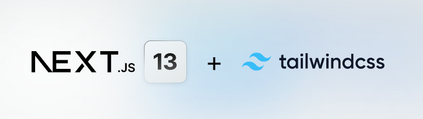
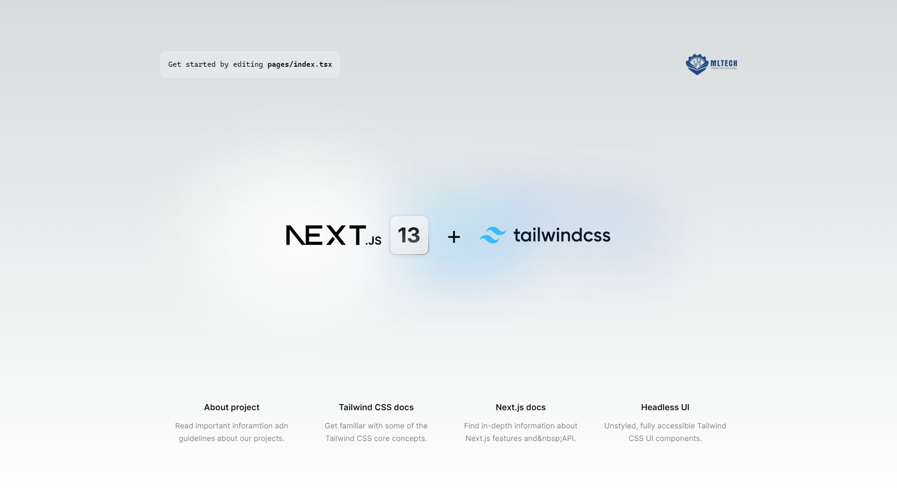

<a name="readme-top"></a>

<!-- PROJECT LOGO -->
<br />
<div align="center">
  <a href="https://github.com/QuocEran/Next.js-Tailwind-Sample">
    
  </a>

  <h3 align="center">Next.js + Tailwind + Typescript sample</h3>

  <p align="center">
    Next.js with Tailwind CSS sample template to jumpstart any project!
    <br />
    <a href="https://github.com/QuocEran/Next.js-Tailwind-Sample#readme"><strong>Explore the docs »</strong></a>
    <br />
    <br />
    <a href="https://github.com/QuocEran/Next.js-Tailwind-Sample">View Demo</a>
    ·
    <a href="https://github.com/QuocEran/Next.js-Tailwind-Sample/issues">Report Bug</a>
    ·
    <a href="https://github.com/QuocEran/Next.js-Tailwind-Sample/issues">Request Feature</a>
  </p>
</div>

<!-- TABLE OF CONTENTS -->
<details>
  <summary>Table of Contents</summary>
  <ol>
    <li>
      <a href="#about-the-project">About The Project</a>
      <ul>
        <li><a href="#built-with">Built With</a></li>
      </ul>
    </li>
    <li>
      <a href="#getting-started">Getting Started</a>
      <ul>
        <li><a href="#prerequisites">Prerequisites</a></li>
        <li><a href="#installation">Installation</a></li>
        <li><a href="#philosophy">Philosophy</a></li>
        <li><a href="#test">Development & Tesing</a></li>
        <li><a href="#test">Deploy to production</a></li>
        <li><a href="#vscode">VSCode information (optional)</a></li>
      </ul>
    </li>
    <li><a href="#Usage">Usage</a></li>
    <li><a href="#roadmap">Roadmap</a></li>
    <li><a href="#contributing">Contributing</a></li>
    <li><a href="#license">License</a></li>
    <li><a href="#contact">Contact</a></li>
    <li><a href="#acknowledgments">Acknowledgments</a></li>

  </ol>
</details>

<!-- ABOUT THE PROJECT -->

## About The Project

<div align="center">
  
</div>

🚀 Simple templete with base configurations written in Next.js, Tailwind CSS and TypeScript.

⚡️ Made with developer experience first: Next.js, TypeScript, ESLint, Prettier, Husky, Zustand, VSCode, Docker, Tailwind CSS, HeadlessUI.

Clone this project and use it to create your own Next.js project.

<p align="right">(<a href="#readme-top">back to top</a>)</p>

### Built With

This section should list any major frameworks/libraries used to bootstrap our project.

- [![Next][Next.js]][Next-url]
- [![React][React.js]][React-url]
- [![TypeScript][TypeScript.com]][TypeScript-url]
- [![TailwindCSS][Tailwindcss.com]][Tailwindcss-url]
- [![HeadlessUI][HeadlessUI.com]][HeadlessUI-url]
- [![Zustand][Zustand.com]][Zustand-url]

<p align="right">(<a href="#readme-top">back to top</a>)</p>

<!-- GETTING STARTED -->

## ✨ Getting Started

Instructions on setting up project locally.

### 🤏🏻 Prerequisites

- Node.js (>= 14.19.0) and npm
- Yarn (>= 1.22.0)

### Philosophy

- ✍🏻 Minimal code
- 💐 SEO-friendly
- 🚀 Production-ready

### Features

Developer experience first:

- 🔥 [Next.js](https://nextjs.org) for Static Site Generator
- 🎨 Integrate with [Tailwind CSS](https://tailwindcss.com) and [Headless UI](https://headlessui.com/)
- 💅 PostCSS for processing Tailwind CSS and integrated to `styled-jsx`
- 🎉 Type checking [TypeScript](https://www.typescriptlang.org)
- ✅ Strict Mode for TypeScript and React 18
- ✏️ Linter with [ESLint](https://eslint.org) (default NextJS, NextJS Core Web Vitals and Airbnb configuration)
- 🛠 Code Formatter with [Prettier](https://prettier.io)
- 🦊 Husky for Git Hooks
- 🗂 VSCode configuration: Debug, Settings, Tasks and extension for PostCSS, ESLint, Prettier, TypeScript
- 🤖 SEO metadata, JSON-LD and Open Graph tags with Next SEO
- 🐳 One command deployment with Docker

Built-in feature from Next.js:

- ☕ Minify HTML & CSS
- 💨 Live reload
- ✅ Cache busting

### 🧰 Installation

- Get a free API_URL at [https://example.com](https://example.com)

- Clone the repo

  ```sh
  git clone https://github.com/QuocEran/Next.js-Tailwind-Sample.git
  ```

- Install packages

  ```sh
  yarn
  ```

- Touch .env file

  ```sh
  touch .env
  ```

- Enter your API_URL in

  ```
  API_URL=https://example.com
  NEXT_PUBLIC_API_URL=https://example.com
  ```

- Then, you can run locally in development mode with live reload:

  ```
  yarn dev
  ```

### 🚀 Development & Tesing

Open http://localhost:3000 with your favorite browser to see your project. For your information, Next JS need to take some time to compile the project for your first time.

#### ⚠️ Naming

- folders & custom hooks -> camel case
- files in pages (routing) -> kebab case
- files in other folders -> pascal case
- custom hooks, modules, enums: -> [...].ts
- pages + components: -> [...].tsx

```
.
├── README.md                 # README file
├── next.config.js            # Next JS configuration
├── public                    # Public folder
│   └── images                # Image used by default template
│       └── png
│       └── jpg
│       └── svg
├── src
│   ├── components            # All app components, separate by modules, pages
│       ├── example           # Example components
│       │   └── Logo.tsx      # Logo components
│       │   └── ...           # others
│       │
│       └──  home             # Homepage components
│
│   ├── data                  # JSON file to render text, internal data files,...(naming & structure same components)
│   ├── layout                # Atomic layout component
│   ├── pages                 # Next JS pages
│   ├── services              # Separate logic modules, custom hooks,...(naming & structure same components)
│   ├── stores                # Zustand files (create store, interface, logic,...)
│   ├── styles                # Global & modules CSS files
│   ├── templates             # Default template
│   ├── types                 # Interfaces, class, generic,... (naming & structure same components)
│   └── utilities             # Utility folder (enums, utils modules,...)
├── tailwind.config.js        # Tailwind CSS configuration
├── tsconfig.json             # TypeScript configuration
├── Dockerfile                # Dockerfile
├── docker-compose.yml        # docker-compose configuration
└── ...                       # Other configuration files (prettier, ignore files,...)

```

#### 🧪 Testing

```
   yarn run test-all
```

### 🌍 Deploy to production

You can see the results locally in production mode with:

```
$ yarn build
$ yarn start
```

The generated HTML and CSS files are minified (built-in feature from Next js). It will also removed unused CSS from [Tailwind CSS](https://tailwindcss.com).

You can create an optimized production build and you deploy with any hosting service by Docker:

```
$ docker-compose up --build -d
```

### 👨🏻‍💻 VSCode information (optional)

If you are VSCode users, you can have a better integration with VSCode by installing the suggested extensions and settings in `.vscode`

<p align="right">(<a href="#readme-top">back to top</a>)</p>

<!-- Commit Message -->

```
 yarn add -D @commitlint/{config-conventional,cli}
 npx husky add .husky/commit-msg ""
```

## Commit Message

```
<type>(<scope>): <short summary>
  │       │             │
  │       │             └─⫸ Summary in present tense. Not capitalized. No period at the end.
  │       │
  │       └─⫸ Commit Scope: animations|bazel|benchpress|common|compiler|compiler-cli|core|
  │                          elements|forms|http|language-service|localize|platform-browser|
  │                          platform-browser-dynamic|platform-server|router|service-worker|
  │                          upgrade|zone.js|packaging|changelog|docs-infra|migrations|
  │                          devtools
  │
  └─⫸ Commit Type: build|ci|chore|docs|feat|fix|perf|refactor|revert|style|test
```

##### Type

Must be one of the following:

- **build**: Changes that affect the build system or external dependencies (example scopes: gulp, broccoli, npm)
- **ci**: Changes to our CI configuration files and scripts (examples: CircleCi, SauceLabs)
- **chore**: add something without touching production code (Eg: update npm dependencies)
- **docs**: Documentation only changes
- **feat**: A new feature
- **fix**: A bug fix
- **perf**: A code change that improves performance
- **refactor**: A code change that neither fixes a bug nor adds a feature
- **revert**: Reverts a previous commit
- **style**: Changes that do not affect the meaning of the code (Eg: adding white-space, formatting, missing semi-colons, etc)
- **test**: Adding missing tests or correcting existing tests

The `<type>` and `<summary>` fields are mandatory, the `(<scope>)` field is optional.

<p align="right">(<a href="#readme-top">back to top</a>)</p>
<!-- USAGE EXAMPLES -->

## Usage

<p align="right">(<a href="#readme-top">back to top</a>)</p>

<!-- ROADMAP -->

## Roadmap

<!-- - [x] Add Changelog
- [x] Add back to top links
- [ ] Add Additional Templates w/ Examples
- [ ] Add "components" document to easily copy & paste sections of the readme
- [ ] Multi-language Support
  - [ ] Chinese
  - [ ] Spanish -->

See the [open issues](https://github.com/QuocEran/Next.js-Tailwind-Sample/issues) for a full list of proposed features (and known issues).

<p align="right">(<a href="#readme-top">back to top</a>)</p>

<!-- CONTRIBUTING -->

## Contributing

Contributions are what make the open source community such an amazing place to learn, inspire, and create. Any contributions you make are **greatly appreciated**.

If you have a suggestion that would make this better, please fork the repo and create a pull request. You can also simply open an issue with the tag "enhancement".
Don't forget to give the project a star! Thanks again!

1. Fork the Project
2. Create your Feature Branch (`git checkout -b feature/AmazingFeature`)
3. Commit your Changes (`git commit -m 'Add some AmazingFeature'`)
4. Push to the Branch (`git push origin feature/AmazingFeature`)
5. Open a Pull Request

<p align="right">(<a href="#readme-top">back to top</a>)</p>

<!-- LICENSE -->

## License

Distributed under the MIT License. See `LICENSE.txt` for more information.

<p align="right">(<a href="#readme-top">back to top</a>)</p>

<!-- CONTACT -->

## Contact

Quoc Erab - [@chuong.tranquoc](https://www.facebook.com/chuong.tranquoc) - quocchuong45@gmail.com

Project Link: [https://github.com/QuocEran/Next.js-Tailwind-Sample](https://github.com/QuocEran/Next.js-Tailwind-Sample)

<p align="right">(<a href="#readme-top">back to top</a>)</p>

<!-- ACKNOWLEDGMENTS -->

## Acknowledgments

I've included a few of my favorites to kick things off!

- [Choose an Open Source License](https://choosealicense.com)
- [GitHub Emoji Cheat Sheet](https://www.webpagefx.com/tools/emoji-cheat-sheet)
- [SEO with Next.js](https://nextjs.org/learn/foundations/about-nextjs)
- [Learn about Next.js](https://nextjs.org/learn/foundations/about-nextjs)
- [Tailwind Blogs](https://tailwindcss.com/blog)
- [Docker overview](https://docs.docker.com/get-started/overview/)

<p align="right">(<a href="#readme-top">back to top</a>)</p>

<!-- MARKDOWN LINKS & IMAGES -->
<!-- https://www.markdownguide.org/basic-syntax/#reference-style-links -->

[contributors-shield]: https://img.shields.io/github/contributors/othneildrew/Best-README-Template.svg?style=for-the-badge
[contributors-url]: https://github.com/QuocEran/Next.js-Tailwind-Sample/graphs/contributors
[forks-shield]: https://img.shields.io/github/forks/othneildrew/Best-README-Template.svg?style=for-the-badge
[forks-url]: https://github.com/QuocEran/Next.js-Tailwind-Sample/network/members
[stars-shield]: https://img.shields.io/github/stars/othneildrew/Best-README-Template.svg?style=for-the-badge
[stars-url]: https://github.com/QuocEran/Next.js-Tailwind-Sample/stargazers
[issues-shield]: https://img.shields.io/github/issues/othneildrew/Best-README-Template.svg?style=for-the-badge
[issues-url]: https://github.com/QuocEran/Next.js-Tailwind-Sample/issues
[license-shield]: https://img.shields.io/github/license/othneildrew/Best-README-Template.svg?style=for-the-badge
[license-url]: https://github.com/QuocEran/Next.js-Tailwind-Sample/blob/master/LICENSE.txt
[linkedin-shield]: https://img.shields.io/badge/-LinkedIn-black.svg?style=for-the-badge&logo=linkedin&colorB=555
[linkedin-url]: https://linkedin.com/in/othneildrew
[product-screenshot]: images/screenshot.png
[Next.js]: https://img.shields.io/badge/next.js-000000?style=for-the-badge&logo=nextdotjs&logoColor=white
[Next-url]: https://nextjs.org/
[React.js]: https://img.shields.io/badge/React-20232A?style=for-the-badge&logo=react&logoColor=61DAFB
[React-url]: https://reactjs.org/
[TypeScript.com]: https://img.shields.io/badge/TypeScript-007ACC?style=for-the-badge&logo=typescript&logoColor=white
[TypeScript-url]: https://www.typescriptlang.org/
[Tailwindcss.com]: https://img.shields.io/badge/Tailwind_CSS-38B2AC?style=for-the-badge&logo=tailwind-css&logoColor=white
[Tailwindcss-url]: https://tailwindcss.com/
[HeadlessUI.com]: https://img.shields.io/badge/headlessui-143157?style=for-the-badge&logo=headlessui&logoColor=white
[HeadlessUI-url]: https://headlessui.com/
[Zustand.com]: https://img.shields.io/badge/zustand-%2320232a.svg?style=for-the-badge&logo=react&logoColor=%2361DAFB
[Zustand-url]: https://github.com/pmndrs/zustand
